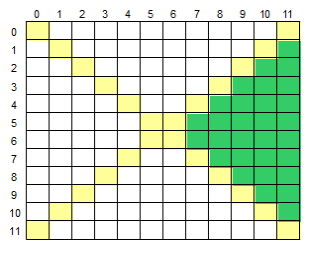

# Problema:   
Leia um caractere maiúsculo, que indica uma operação que deve ser realizada e uma matriz M[12][12]. Em seguida, calcule e mostre a soma ou a média considerando somente aqueles elementos que estão na área direita da matriz, conforme ilustrado abaixo (área verde).



###### OBS: 
Na entrada o caractere Maiúsculo pode ser ('S' ou 'M'), indicando a operação (Soma ou Média).
Como saída é soliticado que imprima o resultado com 1 casa após o ponto decimal.

**Problema Completo**: https://www.urionlinejudge.com.br/judge/pt/problems/view/1190

# Resolução:

Para a resolução deste problema começaremos pensando sobre como identificar os elementos que estão na região em verde, a qual usaremos durante as operações de soma e média. 
Para isso podemos inicialmente utilizar as coordenadas da matriz onde `linha < coluna` região que abrange os valores que estão estritamente acima da diagonal principal. Por outro lado temos a parte onde `linha > 12 - coluna - 1` , onde "12" se refere ao tamanho da matriz e o "-1" ao final se da por conta de a matriz ir de "0 a tamanho-1", esta área abrange as posições que estão abaixo da diagonal secundaria da matriz. 
Realizando a intersecção destas duas atráves do operador `AND` chegaremos à area desejada.


Agora que temos a noção de como iremos resolver o problema, começamos declarando as variáveis que serão utilizadas, a propria matriz com seu tamanho predefinido, variaveis para armazenar o resultado das operações assim como uma variavel do tipo `char` para armazenar a operação escolhida, algumas outras variaveis que serão usadas como contadores para percorrer a matriz. Após as declarações realizamos também a leitura da operação.
```c
double m[12][12], soma, media;
char operacao;
int i, j, cont;
scanf("%c", &operacao);
```


Num primeiro laço `for`, será necessario realizar a leitura dos valores que irão preencher a matriz, para isso passamos linha por linha percorrendo todas suas as colunas. Para isso colocaremos uma função `scanf` dentro de dois laços `for`. Após ter a matriz completa, iremos realizar a comparação em cima de qual operação foi inserido para que possamos calcular o valor que deverá ser apresentado.
```c
for(i = 0; i < 12; i++)
	for(j = 0; j < 12; j++)
		scanf("%lf", &m[i][j]);
```


Em nossa primeira condição, caso seja um "S" iremos realizar a Soma dos valores presentes na área verde, para isso, assim como durante a fase de leitura dos valores da matriz, iremos percorre-la mas desta vez ao passar pelos os valores realizamos a verificação a respeito da `linha x coluna` que o mesmo se encontra, caso se encaixe naquelas condições explicadas no inicio, incrimentamos à variavel soma com o valor contido na posição verificada. Ao final da leitura de toda a matriz, imprimimos através da função `print` o valor contido na variavel `soma` obedecendo a condição solicitade de possuir apenas 1 digito após a virgula.
```c
if (operacao == 'S'){
	soma = 0;
	for(i = 0; i < 12; i++)
		for(j = 0; j < 12; j++)
			if (i < j && i > 12 - j - 1)
				soma += m[i][j];

	printf("%.1lf\n", soma);
}
```


Em nossa segunda condição, caso seja um "M" iremos realizar a Média dos valores presentes na área verde, para isso, assim como no caso anterior iremos percorrer elemento por elemento da matriz e iremos realizar a soma dos elementos que estão presentes na área verde, porém paraa cada elemento que estiver dentro desta área iremos incrementar uma variavel `cont` em 1, pois ao final iremos dividir a soma dos valores pelo valor presente em `cont`, desta forma iremos obter a média. Ao final imprimimos através da função `print` o valor resultante de `media/cont` obedecendo a condição solicitade de possuir apenas 1 digito após a virgula.
```c
if (operacao == 'M'){
	media = 0;
	cont = 0;
	for(i = 0; i < 12; i++)
		for(j = 0; j < 12; j++)
			if (i < j && i > 12 - j - 1){
				media += m[i][j];
				cont++;
			}

	printf("%.1lf\n", media/cont);
}
```


Caso tenha alguma dúvida sobre este problema ou sobre a resolução, entre em contato com o PET-BCC pelo nosso
[Facebook](https://www.facebook.com/petbcc/),
[Instagram](https://www.instagram.com/petbcc.ufscar/)
ou nos mande um e-mail com o assunto "URI" para  petbcc.ufscar@gmail.com